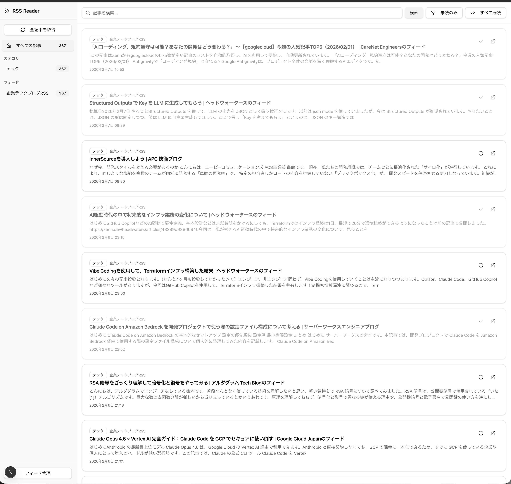

# RSS Reader

Next.js で構築されたモダンな RSS リーダーアプリケーションです。



## 技術スタック

| レイヤー | 技術 |
|----------|------|
| フロントエンド | React 19 + Next.js 16 (App Router) |
| UI | Shadcn/ui + Tailwind CSS v4 |
| バックエンド | Hono (軽量 Web フレームワーク) |
| データベース | SQLite + Drizzle ORM |
| RSS 解析 | rss-parser |

## 機能

- **フィード管理**: RSS フィード URL の登録・編集・削除、カテゴリ分類
- **記事取得**: 全フィードからの一括取得、個別フィードの更新
- **記事閲覧**: フィード別・カテゴリ別フィルタリング、タイトル検索、未読のみ表示
- **既読管理**: 個別/一括既読化、未読バッジ表示

## プロジェクト構成

```
src/
├── app/
│   ├── api/[[...route]]/route.ts  # Hono API サーバー
│   ├── page.tsx                    # ホーム（記事一覧）
│   ├── feeds/page.tsx              # フィード管理ページ
│   ├── layout.tsx                  # ルートレイアウト
│   └── globals.css                 # グローバルスタイル
├── components/
│   ├── sidebar.tsx                 # サイドバーナビゲーション
│   ├── article-list.tsx            # 記事一覧コンポーネント
│   ├── article-card.tsx            # 記事カード
│   ├── feed-form.tsx               # フィード登録ダイアログ
│   ├── feed-list.tsx               # フィード管理リスト
│   └── ui/                         # Shadcn/ui コンポーネント
├── db/
│   ├── schema.ts                   # Drizzle ORM スキーマ
│   └── index.ts                    # データベース初期化
└── lib/
    ├── api.ts                      # クライアント側 API クライアント
    ├── rss-parser.ts               # RSS パーサーラッパー
    └── utils.ts                    # ユーティリティ関数
```

## データベース構造

### feeds テーブル

| カラム | 型 | 説明 |
|--------|------|------|
| id | INTEGER | 主キー |
| title | TEXT | フィードタイトル |
| url | TEXT | フィード URL（ユニーク） |
| category | TEXT | カテゴリ（デフォルト: 未分類） |
| createdAt | TIMESTAMP | 作成日時 |
| updatedAt | TIMESTAMP | 更新日時 |

### articles テーブル

| カラム | 型 | 説明 |
|--------|------|------|
| id | INTEGER | 主キー |
| feedId | INTEGER | フィード ID（外部キー） |
| title | TEXT | 記事タイトル |
| link | TEXT | 記事 URL（ユニーク） |
| description | TEXT | 記事概要 |
| pubDate | TIMESTAMP | 公開日時 |
| isRead | BOOLEAN | 既読フラグ |
| createdAt | TIMESTAMP | 作成日時 |

## API エンドポイント

### フィード管理

- `GET /api/feeds` - フィード一覧取得（記事数・未読数付き）
- `POST /api/feeds` - フィード登録
- `PATCH /api/feeds/:id` - フィード更新
- `DELETE /api/feeds/:id` - フィード削除
- `POST /api/feeds/:id/fetch` - 個別フィードの記事取得
- `POST /api/feeds/fetch-all` - 全フィードの記事取得

### 記事管理

- `GET /api/articles` - 記事一覧取得（フィルタ対応）
  - `feedId`: フィード ID でフィルタ
  - `category`: カテゴリでフィルタ
  - `search`: タイトル検索
  - `unreadOnly`: 未読のみ
  - `limit` / `offset`: ページネーション
- `PATCH /api/articles/:id/read` - 既読状態切替
- `POST /api/articles/mark-all-read` - 一括既読化

### カテゴリ

- `GET /api/categories` - カテゴリ一覧取得

## セットアップ

### 必要条件

- Node.js 18 以上
- npm / yarn / pnpm / bun

### インストール

```bash
# 依存関係のインストール
npm install

# データベースのマイグレーション
npx drizzle-kit push

# 開発サーバーの起動
npm run dev
```

[http://localhost:3000](http://localhost:3000) をブラウザで開いてください。

## 使い方

1. `/feeds` ページでRSSフィードURLを登録
2. 「全記事を取得」ボタンで記事を取得
3. サイドバーからフィード・カテゴリを選択して記事を閲覧
4. 記事タイトルをクリックして元記事を開く（自動で既読化）

## ライセンス

MIT
